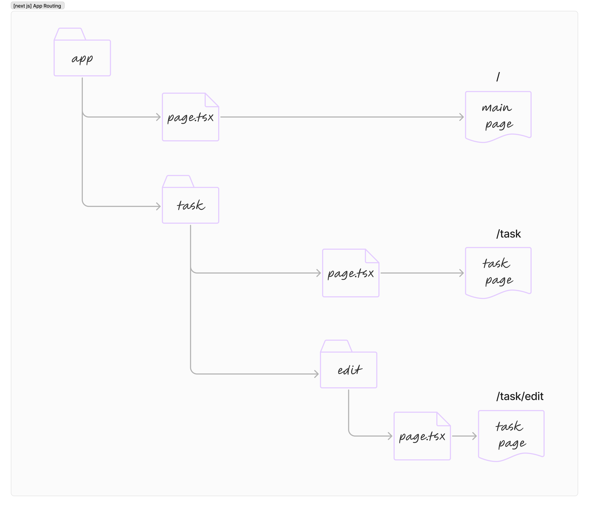

# The basic of the design thinking

## 디자인 싱킹

> 소프웨어 개발에서 발생하는 문제
>
> 시스템을 개발할 때마다 소프트웨어 아키텍쳐는 언제나 알아낼 예정 `to be discovered` (TBD)인 상태.
>
> 우리가 원하는 아키텍쳐는 저멀리 어딘가에 있고 우리가 알아내 주길 기다리고 있다.
>
> 소프트웨어 시스템을 설계하는 일은 문제를 해결하는 동시에 아직 발견하지 못한 문제를 찾아가는 일.

디자인 싱킹 `Design Thinking` 은 문제 해결의 모든 기준을 인간에 두고, 창의적이고 분석적으로 문제를 풀어나가는 접근법

인간에게 초첨을 두면 설계에 대한 의사결정을 할 때 문제의 본질에 집중할 수 있다. 뿐만 아니라 해결법을 찾을 때마다 소프트웨어를 만드는 목적이 바로 사람들을 돕는 일이라는 점도 일깨워 준다.

### 디자인 싱킹의 네 가지 원칙 (HART)

> 디자인 싱킹은 문제를 해결하려는 과정이라기보다는 문제와 해결책 그리고 이에 영향을 받는 사람들의 관점에 대해 생각하는 방식이라고 할 수 있다.

1. 인간 중심의 원칙 `human rule` : 모든 디자인은 사회적이다.
2. 모호함의 원칙 `ambiguity rule` : 모호함을 유지하라.
3. 재디자인의 원칙 `redisign rule` : 모든 디자인은 다시 디자인한 것이다.
4. 촉각의 원칙 `tangibility rule`  : 손에 잡히는 디자인이 대화를 이끌어낸다.

#### 모든 디자인은 사회적이다.

디자인은 본질적으로 인간중심의 노력이다. 우리는 사람을 위해 소프트웨어를 디자인하며, 사람들과 함께 소프트웨어를 디자인한다. 아키텍쳐에 대한 모든 의사결정은 어떤 식으로든 개인에게 도움을 준다. 설계에 대한 모든 의사결정은 사람이 이해할 수 있어야 하고 다른 사람과 공유할 수 있어야 한다.

* 아키텍트는 모든 이해관계자와 공감대를 형성해야 한다.&#x20;


모든 이해관계자 : 사용자, 개발자, 테스터, 매니져 등...


소프트웨어를 설계할 때는 여러사람과 협업할 수 밖에 없으므로, 사람을 존중하는 마음가짐으로 의견을 경청하고, 긍정적인 의지를 표하고, 인간중심적인 설계 방법을 활용하며 일을 진행해야 한다.

* 아키텍트는 팀원들과 직접 소통하면서 설계해야 한다.

아키텍트는 팀과 분리된 사람이아니라 팀의 일부.

시스템 설계에 관여하는 모든 사람을 신경 쓸수록 더 나은 설계자이자 커뮤니케이터이자 리더가 될 수 있다.

#### 모호함을 유지하라.

설계를 확정하기 전까지는 당분간 모호하게 놔두는 방법도 쓸 수 있다.

소프트웨어 아키텍쳐의 목적은 품질 속성을 끌어올릴 수 있도록 여러 구조를 정리하는 것이다.

* 최소한의 아키텍쳐
  * 달성해야하는 가장 중요한 품질속성만 제시
  * 가장 중요한 품질 속성을 방해하는 위험 요소는 줄이며
  * 그 외의 의사결정은 하위 설계자에게 위임

최소주의는 책임 있는 범위만큼만 설계에 대한 의사결정을 하겠다는 의미이기도 하다.

모호함을 유지하면 주변 상황이 바뀌더라도 소프트웨어를 제때 공급할 수 있다.

#### 모든 디자인은 재디자인한 것이다.

다시 디자인하다는 의미는 과거의 디자인에서 패턴을 찾고 고찰해 보는 것.

소프트웨어 아키텍쳐를 설계할 때 바닥부터 새롭게 만드는 것보다 현재의 설계를 갈고닦는 데에 더 많은 시간을 쓸 수도 있다. 가장 비효율적인 일 중 하나는 과거에 존재했던 시스템을 무시하는 것.

#### 손에 잡히는 디자인이 대화를 이끌어낸다

아키텍쳐를 손에 잡히게 하는 방법

* 그림을 그리고, 코드를 구현하기.
* 프로토타입을 만들어서 사람들이 품질 속성과 아키텍쳐를 직접 경험할 수 있게 하기.
* 단순한 모델을 만들어서 아키텍쳐의 한 부분을 보여주기.
* 공감할 수 있는 메타포를 만들기.
* 시스템 흐름의 일부를 직접 동작해 보기.

> 인간은 공감함으로써 아이디어를 내면화한다.

## 디자인 마인드셋 장착하기

소프트웨어에서 시스템을 설계할 때는 여러 관점의 <mark style="color:blue;">**디자인 마인드셋**</mark> design mindset 을 가지고 진행한다. 디자인 마인드셋은 세상을 이해하는 방법이며 제때에 알맞은 수준의 디테일을 챙길 수 있게 한다.

4가지 디자인 마인드셋

1. 이해하기 understand
2. 탐색하기 explore
3. 실현하기 make
4. 평가하기 eveluate

각각의 디자인 마인드셋마다 훈련이 필요하다.

아키텍쳐 설계를 위한 마인드셋 선택 >>> 마인드셋에 대한 훈련 방법 선택 >>> 선택한 훈련을 적용해 아키텍쳐의 새로운 부분을 발견 >>> 반복

> 마인드셋 별로 어떤 훈련이 필요한가?

### 문제 이해하기

이해관계자들의 요구사항을 적극적으로 알아내고 문제로 기술하는 방법을 훈련

이해한다는 것은 공감이며 이는 요구사항의 하나이다.&#x20;

문제를 이해하려면?

* &#x20;시스템을 직접다루는 사람과 그사람이 필요로 하는 것을 알아야 한다.
* 이해관계자들이 중요하게 생각하는 비지니스 목표와 품질 속성도 조사해야 한다.&#x20;
* 어떻게 팀을 운영하고 설계할 때 트레이드오프와 우선순위를 결정하는지도 배워야 한다.

### 아이디어 탐색하기

`브레인 스토밍` 디자인 싱킹의 시작과 끝

브레인 스토밍은 강력하지만 탐색하기 단계에서는 훈련 방법중 하나.

아키텍쳐를 탐색한다는 것은 여러구조를 조합하다가 품질 속성을 최대한으로 끌어 올릴 최선의 조합을 찾는다는 의미

다양한 패턴, 기술, 구현방법을 조사해야 한다.

### 아이디어 실현하기

다른 사람에게 아이디어를 전달하는 방법 제공

아이디어 자체를 실험해 볼 수 있는 기회 제공

설계 콘셉트를 현실세계의 실체로 만들게 된다.

### 평가하기

설계상의 의사결정이 실제 인식과 얼마나 잘 맞는지 평가

평가 대상 방법은 다양하다.

* 아키텍쳐의 전체 또는 부분
* 모델 하나만 평가하기
* 아이디어만 평가하기
* 아키텍쳐의 한부분을 다양한 시나리오로 적용해보는 방법
* 직접적인 실험을 진행
* 위험 요소를 검사

> 디자인 마인드셋이 제대로 동작하려면 빠른 피드백의 순환 고리를 만들어 단계별로 빠르게 옮겨갈 수 있어야 한다.

## 생각 - 실행 - 확인 하기

소프트웨어 개발을 할 수록 `새로운 지식`도 많아진다.

`새로운 지식`으로 `더 나은 아키텍쳐`를 만들고 또 이를 이용하여 `새로운 지식`을 창출할 수 있다.

> 이 선순환을 계속하려면 설계할 때 빠른 피드백 순환 고리를 만들어서 지속적인 변화로 기회를 만들어내야 한다.

### 지속적인 학습을 위한 선순환

\= 빠른 피드백을 위한 순환 고리

* 생각 `think`
* 실행 `do`
* 확인 `check`

#### 생각 :&#x20;

* 무엇을 배우고 싶은가?
* 어떤 질문에 대한 답을 구하는가?
* 현재 제일 위험한 요소는 무엇인가?

구체적인 질문에 대한 답을 생각해보거나 위험 요소를 줄이는 방법을 생각해보자!

#### 실행 :

계획한 바를 실천

손에 잡히는 결과를 만들어 보며, 필요한 정보를 파악하거나 아이디어를 공유하자!

#### 확인 :

실행하기 단계에서 했던 항목들을 비판적으로 평가

다음 목표를 설정

다시 생각하기 단계로 돌아가서 반복

> 소프트웨어 개발은 중단 되지 않는다. 다만 릴리스가 계속될 뿐... 설계의 순환을 통해 지속적인 학습을 통한 개선 또는 해결을 반복하면 될 뿐...

### 어떤 상황에서든 마인드셋을 활용하자

네가지 마인드 셋은 도구상자

설계 작업을 할 때마다 알맞은 상자에서 필요한 도구를 꺼내 쓰면 된다.

<figure><figcaption></figcaption></figure>

> 디자인 싱킹은 소프트웨어를 개발하는 데서 기술과 사람을 잇는 법을 알려준다. HART 원리는 소프트웨어에 마음을 심는 일. 우리는 디자인 마인드셋을 이용하 이해관계자들이 원하던 결과를 더 정확히 파악하고 더 나은 의사결정을 할 수 있게 된다.
